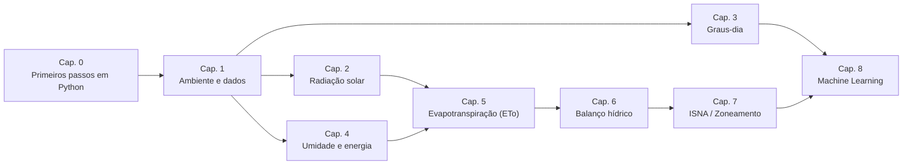

# 🌱 Agrometeorologia Aplicada com Python

Este repositório reúne notebooks didáticos utilizados na área de **Agrometeorologia**, com foco na análise de dados climáticos, caracterização clima–solo–cultura e aplicação em balanço hídrico agrícola, utilizando **Python no Google Colab** 

Os notebooks foram desenvolvidos com abordagem prática, utilizando dados reais e exemplos aplicados à agricultura brasileira.
---
Apresentação: [Manipulação e visualização inteligente de dados meteorológicos](https://docs.google.com/presentation/d/1WEEhoKqe4tz6hYs61jR8Msn0t49pVcof72aSf2N6urk/preview?slide=id.p1)
---

Como citar?
---

OLIVEIRA, Fabricio Correia de. Agrometeorologia: v. 1.0. Zenodo, 2026. DOI: 10.5281/zenodo.1934288. Disponível em: https://doi.org/10.5281/zenodo.1934288. Acesso em: 30 mar. 2026.

## 🎯 Objetivos da disciplina

Ao final do Curso, discentes são capazes de avaliar o efeito de elementos climáticos e meteorológicos sobre o planejamento de uso da terra e das operações agrícolas e pecuárias, relacionando informações de tempo e clima com os sistemas de produção agropecuária, com decisões sustentáveis e inovadoras. 

---

## 🗂️ Mapa do repositório

O repositório tem **dois materiais didáticos** (os notebooks da disciplina em `01-07` e o curso `curso/`, mais completo e passo a passo), que consomem os mesmos **dados brutos** e se apoiam nos **pacotes** `agrometeorologiapy` e `climas_brasil`. As páginas HTML são visualizações complementares, independentes dos notebooks.

```mermaid
graph TD
    subgraph NB["📚 Notebooks da disciplina (raiz)"]
        direction TB
        N1["01_dados_nasapower"]
        N2["02_climogramas_br"]
        N3["03_infos_clima_solo"]
        N4["04_infos_cultura"]
        N5["05_bh_climatologico"]
        N6["06_bh_cultura"]
        N7["07_graficos_gerais"]
        N8["GAMBITEC_DADOS_SH — extra"]
    end

    subgraph CURSO["🎓 curso/ — Agrometeorologia Operacional"]
        direction LR
        C0["0 Primeiros passos em Python"] --> C1["1 Ambiente"] --> C2["2 Radiação"] --> C3["3 Graus-dia"] --> C4["4 Umidade"] --> C5["5 ETo"] --> C6["6 Bal. hídrico"] --> C7["7 ISNA"] --> C8["8 Machine Learning"]
    end

    subgraph DADOS["📊 Dados brutos"]
        direction TB
        D1["clima_solo_br.csv\nclima_solo_local.csv"]
        D2["dados_culturas.csv"]
        D3["dta_brazil.csv"]
        D4["terraclimate_pet_normal_brasil.csv"]
        D5["SIMEPAR_dados_diario.csv"]
        D6["geojson_br.zip"]
    end

    subgraph LIB["📦 Pacotes relacionados (repos externos)"]
        direction TB
        L1["agrometeorologiapy\nfórmulas prontas"]
        L2["climas_brasil\nKöppen · Camargo · Thornthwaite"]
    end

    subgraph WEB["🌐 Páginas HTML standalone"]
        direction TB
        W1["index.html / index_2.html"]
        W2["nasapower.html"]
        W3["previsao.html / setedias.html"]
        W4["simeparsh.html"]
    end

    DADOS -.alimenta.-> NB
    DADOS -.alimenta.-> CURSO
    L1 -.chamado por.-> NB
    L1 -.ensinado, capítulo a capítulo, em.-> CURSO
    L2 -.classificação climática usada em.-> DADOS
```

- **Notebooks da disciplina** (`01` a `07` + extra): usam o pacote `agrometeorologiapy` pronto — o foco é aplicar e interpretar os resultados.
- **`curso/`**: ensina a teoria e as fórmulas de cada tema, capítulo a capítulo, aplicando-as diretamente com a `agrometeorologiapy` — ver seção [🎓 Curso: Agrometeorologia Operacional com Python](#-curso-agrometeorologia-operacional-com-python) abaixo.
- **Dados brutos** (`.csv`/`.zip`): não precisam ser abertos manualmente, são lidos direto pelos notebooks via URL.
- **Páginas HTML**: dashboards estáticos (Tailwind/Chart.js/Leaflet) com dados de Santa Helena-PR, independentes dos notebooks.

---

## 🧰 Ferramentas relacionadas

Este repositório é o material didático da disciplina. Duas ferramentas complementares, também de autoria do professor, dão suporte aos cálculos e aos dados climáticos usados aqui:

- **[agrometeorologiapy](https://github.com/fcoliveira-utfpr/agrometeorologiapy)** ([PyPI](https://pypi.org/project/agrometeorologiapy/)): pacote Python com as fórmulas de agrometeorologia usadas nos notebooks — radiação solar, evapotranspiração (Thornthwaite, Camargo-Maluf, Hargreaves-Samani, Priestley-Taylor, Penman-Monteith FAO-56), grau-dias e balanço hídrico —, documentadas e testadas. É a implementação usada a partir dos notebooks `01`, `05` e `06`.
- **[climas_brasil](https://github.com/fcoliveira-utfpr/climas_brasil)**: classificação climática (Köppen-Geiger, Camargo, Thornthwaite) por município brasileiro, calculada de forma consistente a partir do TerraClimate (normais 1991-2020). É a fonte das colunas `Köppen`, `Camargo` e `Thornthwaite` em `clima_solo_br.csv`/`clima_solo_local.csv`.

---

## 🚀 Como utilizar os notebooks

1. Abra o notebook desejado diretamente no GitHub  
2. Clique em **“Open in Colab”**
3. Faça uma cópia para seu Drive ou Execute as células **na ordem**  
5. Leia atentamente os textos explicativos (Markdown) e comentários no código
6. Para baixar arquivos retire o # e execute o bloco de código
7. Os arquivos com final .csv são dados brutos, não precisar ser abertos

---

## 📚 Organização dos notebooks

### 🔹 1. Dados climáticos

#### `01_dados_nasapower.ipynb`

**Objetivo:**  
Obter dados meteorológicos da base [**NASA/POWER**](https://power.larc.nasa.gov/) por município.

**Conteúdos abordados:**
- Permite visualizar todos os ESTADOS e MUNICÍPIOS
- Baixa dados meteorológicos do NASA/POWER em escala diária, mensal e de uma Normal Climatológica

---

### 🔹 2. Caracterização climática e climogramas

#### `02_climogramas_br.ipynb`

**Objetivo:**  
Analisar o regime climático e construir **climogramas**.

**Conteúdos abordados:**
- Permite visualizar todos os ESTADOS e MUNICÍPIOS
- Gera tabela com Tmed - dados do [Alvares et al. (2013)](https://www.schweizerbart.de/papers/metz/detail/22/82078/Koppen_s_climate_classification_map_for_Brazil?af=crossref) e chuva mensal - dados do TerraClimate
- Constrói gráfico climograma (temperatura média mensal e precipitação acumulada mensal) - Análises temporal
- Constrói mapa da chuva por estado - Análises espacial de dados anuais
- Constrói mapa da temperatura por estado - Análises espacial de dados anuais
- Constrói mapa de Classificação Climática de Köppen-Geiger

---

### 🔹 3. Informações de solo e clima

#### `03_infos_clima_solo.ipynb`

**Objetivo:**  
Integrar informações climáticas e propriedades do solo relevantes ao manejo agrícola.

**Conteúdos abordados:**
- Permite visualizar todos os ESTADOS e MUNICÍPIOS
- Gera Tabela de informações do município: **Altitude (m)**,	**DTA (mm/m)**,	**clima KöppenGeiger**,	**latitude e longitude** do centroide do município
- Permite visualizar por Estado no mapa: município, latitude, longitude
- Permite visualizar por Estado no mapa: município, DTA [Atlas Irrigação, 2021](https://metadados.snirh.gov.br/geonetwork/srv/api/records/1b19cbb4-10fa-4be4-96db-b3dcd8975db0)
- Permite visualizar por Estado no mapa: município, clima Köppen-Geiger
- Município e estado pela latitude e longitude
- Informações do solo pela lat e lon

---

### 🔹 4. Informações de cultura agrícola

#### `04_infos_cultura.ipynb`

**Objetivo:**  
Organizar parâmetros fenológicos e fisiológicos das culturas agrícolas.

**Conteúdos abordados:**
- Permite visualizar todas as CULTURAS do banco de dados
- *São obtidos os seguintes dados das culturas* [Allen et al. (1998)](https://www.fao.org/4/x0490e/x0490e00.htm):
- **F1 (%)** – Fase inicial do ciclo da cultura  
- **F2 (%)** – Fase de desenvolvimento da cultura  
- **F3 (%)** – Fase média (máximo desenvolvimento) da cultura  
- **F4 (%)** – Fase final (maturação/senescência) da cultura  

- **f** – Fator de depleção da água disponível no solo  

- **Kc ini** – Coeficiente de cultura na fase inicial  
- **Kc méd** – Coeficiente de cultura na fase média  
- **Kc fin** – Coeficiente de cultura na fase final  

- **Z efetivo (m)** – Profundidade efetiva do sistema radicular  

- **Ky₁** – Fator de resposta da cultura ao déficit hídrico na fase 1  
- **Ky₂** – Fator de resposta da cultura ao déficit hídrico na fase 2  
- **Ky₃** – Fator de resposta da cultura ao déficit hídrico na fase 3  
- **Ky₄** – Fator de resposta da cultura ao déficit hídrico na fase 4  

- **Ky total** – Fator de resposta global da cultura ao déficit hídrico  

---

### 🔹 5. Balanço climatológico

#### `05_bh_climatologico.ipynb`

**Objetivo:**  
Calcular e analisar o **balanço hídrico climatológico** integrando clima e solo.

**Conteúdos abordados:**
- Permite visualizar todos os ESTADOS e MUNICÍPIOS
- Baixa dados da Normal Climatológica do TerraClimate (1991-2020)
- Calcula o balanço hídrico climatológico de Thothwaite-Mather em escala mensal
- Constrói gráfico do Extrato do Balanço Hídrico
- Constrói gráfico de água no solo
- Constrói gráfico de retiradas e reposições de água
- Constrói gráfico do balanço hídrico
 
---
### 🔹 6. Balanço hídrico da cultura

#### `06_bh_cultura.ipynb`

**Objetivo:**  
Calcular e analisar o **balanço hídrico agrícola** integrando clima, solo e cultura.

**Conteúdos abordados:**
- Permite visualizar todos os ESTADOS e MUNICÍPIOS
- Para cada município, cultura, ano e data de semeadura, calcula o balanço hídrico de cultura
- calcula o ISNA diário para o ciclo da cultura
- calcula o ISNA para cada fase da cultura 

---
### 🔹 7. NoteBook para gráficos gerais

#### `07_graficos_gerais.ipynb`

**Objetivo:**  
Construção de gráficos gerais, barra, linhas, heatmap, boxplot.

**Conteúdos abordados:**
- Construir gráficos
---
---
### 🔹 EXTRA 1. baixar dados de SANTA HELENA - PR

#### `GAMBITEC_DADOS_SH.ipynb`

**Objetivo:**  
Baixar dados meteorológicos para Santa Helena - PR.

**Conteúdos abordados:**
- Baixa dados do SIMEPAR para Santa Helena - PR

---
---

## 🎓 Curso: Agrometeorologia Operacional com Python

Pasta [`curso/`](curso/). Assim como os notebooks acima, este curso usa a `agrometeorologiapy` diretamente — a diferença é o ritmo: começando pelos fundamentos de Python e passando, capítulo a capítulo, pela teoria e as fórmulas de cada tema (radiação solar, graus-dia, umidade, evapotranspiração, balanço hídrico, ISNA) até um modelo de Machine Learning para produtividade, sempre explicando a matemática por trás de cada função da biblioteca antes de usá-la. Só entra código próprio quando a biblioteca não cobre algo (ex.: partição de energia, agregação de ISNA por ciclo).

| Cap. | Notebook | Tema | Pré-requisito |
|---|---|---|---|
| 0 | [`00_primeiros_passos_python_agro.ipynb`](curso/00_primeiros_passos_python_agro.ipynb) | Primeiros passos em Python: tipos de dados, operadores, listas/dicionários/DataFrames, lógica condicional e um primeiro uso do `agrometeorologiapy` | — |
| 1 | [`01_ambiente_e_dados.ipynb`](curso/01_ambiente_e_dados.ipynb) | Ambiente de trabalho, notebooks e primeiros dados | Cap. 0 |
| 2 | [`02_radiacao_solar.ipynb`](curso/02_radiacao_solar.ipynb) | Radiação solar e fotoperíodo | Cap. 1 |
| 3 | [`03_temperatura_graus_dia.ipynb`](curso/03_temperatura_graus_dia.ipynb) | Temperatura, graus-dia e fenologia | Cap. 1, 2 |
| 4 | [`04_umidade_energia.ipynb`](curso/04_umidade_energia.ipynb) | Umidade do ar e balanço de energia | Cap. 1-3 |
| 5 | [`05_evapotranspiracao.ipynb`](curso/05_evapotranspiracao.ipynb) | Evapotranspiração de referência (Hargreaves-Samani × Penman-Monteith FAO-56) | Cap. 1-4 |
| 6 | [`06_balanco_hidrico.ipynb`](curso/06_balanco_hidrico.ipynb) | Balanço hídrico climatológico operacional (Thornthwaite & Mather) | Cap. 1-5 |
| 7 | [`07_isna_zoneamento.ipynb`](curso/07_isna_zoneamento.ipynb) | Zoneamento agroclimático via ISNA | Cap. 1-6 |
| 8 | [`08_machine_learning.ipynb`](curso/08_machine_learning.ipynb) | Predição de produtividade com Machine Learning | Cap. 1-7 |

---
### 🔹 EXTRA 2. Base de dados utilizados na aplicação

- [Atlas Irrigação, 2021](https://metadados.snirh.gov.br/geonetwork/srv/api/records/1b19cbb4-10fa-4be4-96db-b3dcd8975db0)
- [climas_brasil](https://github.com/fcoliveira-utfpr/climas_brasil): classificação Köppen-Geiger, Camargo e Thornthwaite por município (TerraClimate, normais 1991-2020) — substitui a classificação de [Alvares et al. (2013)](https://www.schweizerbart.de/papers/metz/detail/22/82078/Koppen_s_climate_classification_map_for_Brazil?af=crossref), usada em versões anteriores deste repositório
- [NASA/POWER](https://power.larc.nasa.gov/)
- Terra Climate via Google Earth Engine
- [INMET](https://portal.inmet.gov.br/)
- [SIMEPAR](https://www.simepar.br/)
- [IAT](https://www.iat.pr.gov.br/)

**👨‍🏫 Autor**

Prof. Fabrício Correia de Oliveira 

Universidade Tecnológica Federal do Paraná (UTFPR)

[Currículo Lattes](http://lattes.cnpq.br/9528194038713972)
