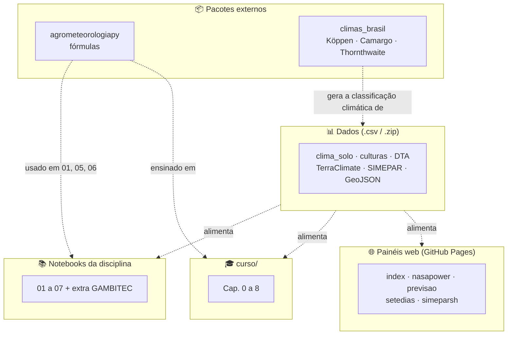
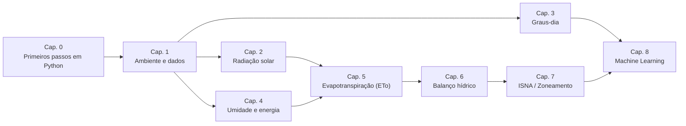

# 🌱 Agrometeorologia Aplicada com Python

Material didático da área de **Agrometeorologia** do curso de Agronomia da **UTFPR – Campus Santa Helena**. São notebooks em **Python para o Google Colab**, com dados reais e exemplos da agricultura brasileira. Os temas vão da obtenção de dados climáticos à caracterização clima–solo–cultura e ao balanço hídrico agrícola.

📽️ Apresentação: [Manipulação e visualização inteligente de dados meteorológicos](https://docs.google.com/presentation/d/1WEEhoKqe4tz6hYs61jR8Msn0t49pVcof72aSf2N6urk/preview?slide=id.p1)

---

## 📑 Sumário

- [Objetivos da disciplina](#-objetivos-da-disciplina)
- [Início rápido](#-início-rápido)
- [Mapa do repositório](#️-mapa-do-repositório)
- [Notebooks da disciplina](#-notebooks-da-disciplina)
- [Curso: Agrometeorologia Operacional com Python](#-curso-agrometeorologia-operacional-com-python)
- [Painéis web (GAMBITEC Data)](#-painéis-web-gambitec-data)
- [Dados do repositório](#-dados-do-repositório)
- [Ferramentas relacionadas](#-ferramentas-relacionadas)
- [Fontes de dados](#-fontes-de-dados)
- [Como citar](#-como-citar)

---

## 🎯 Objetivos da disciplina

Ao final do curso, os discentes são capazes de avaliar o efeito de elementos climáticos e meteorológicos sobre o planejamento de uso da terra e das operações agrícolas e pecuárias. Para isso, relacionam informações de tempo e clima com os sistemas de produção agropecuária, apoiando decisões sustentáveis e inovadoras.

---

## 🚀 Início rápido

1. Escolha um notebook nas tabelas abaixo e clique no botão **Open in Colab**.
2. No Colab, use **Arquivo → Salvar uma cópia no Drive** para poder editar à vontade.
3. Execute as células **na ordem**. A primeira célula de cada notebook instala e importa as bibliotecas.
4. Leia os textos explicativos (Markdown) e os comentários do código.
5. Para baixar os resultados, retire o `#` da linha indicada e execute o bloco.

> 💡 Os arquivos `.csv` e `.zip` do repositório são lidos direto pelos notebooks via URL. Não é preciso baixá-los nem abri-los manualmente.

**Por onde começar?**
- Nunca programou? Comece pelo [Cap. 0 – Primeiros passos em Python](curso/00_primeiros_passos_python_agro.ipynb).
- Quer resultados para um município (dados, climograma, balanço hídrico)? Use os [notebooks da disciplina](#-notebooks-da-disciplina).
- Quer entender a teoria e as fórmulas por trás dos cálculos? Siga o [curso](#-curso-agrometeorologia-operacional-com-python).

---

## 🗂️ Mapa do repositório

O repositório reúne **dois materiais didáticos** que usam os mesmos dados e se apoiam nos pacotes `agrometeorologiapy` e `climas_brasil`:

- os **notebooks da disciplina** (`01`–`07`), aplicados, para gerar e interpretar resultados;
- o **curso** (`curso/`), passo a passo, que ensina a teoria e as fórmulas.

Os **painéis web** são visualizações complementares e independentes dos notebooks.

---

## 📚 Notebooks da disciplina

| # | Notebook | O que faz | Abrir |
|---|---|---|---|
| 1 | [`01_dados_nasapower`](01_dados_nasapower.ipynb) | Baixa dados [NASA/POWER](https://power.larc.nasa.gov/) por município ou coordenada (diário, mensal e Normal Climatológica) |  |
| 2 | [`02_climogramas_br`](02_climogramas_br.ipynb) | Climogramas e mapas estaduais de chuva, temperatura e Köppen-Geiger |  |
| 3 | [`03_infos_clima_solo`](03_infos_clima_solo.ipynb) | Altitude, DTA, clima e coordenadas por município; mapas e consulta por lat/lon |  |
| 4 | [`04_infos_cultura`](04_infos_cultura.ipynb) | Parâmetros de culturas agrícolas (fases, Kc, f, Z, Ky) |  |
| 5 | [`05_bh_climatologico`](05_bh_climatologico.ipynb) | Balanço hídrico climatológico de Thornthwaite-Mather (TerraClimate 1991-2020) |  |
| 6 | [`06_bh_cultura`](06_bh_cultura.ipynb) | Balanço hídrico da cultura, ISNA diário e por fase, e produtividade potencial (PP) e atingível (PA) (dados diários NASA/POWER) |  |
| 7 | [`07_graficos_gerais`](07_graficos_gerais.ipynb) | Gráficos de linhas, barras, boxplot e heatmap a partir do **seu próprio** arquivo CSV/Excel |  |
| Extra | [`GAMBITEC_DADOS_SH`](GAMBITEC_DADOS_SH.ipynb) | Dados diários do SIMEPAR para Santa Helena-PR, com gráficos |  |

<b>Detalhes de cada notebook</b> (clique para expandir)

#### 1. Dados climáticos: `01_dados_nasapower`
- Lista todos os estados e municípios.
- Baixa dados meteorológicos do NASA/POWER nas escalas diária e mensal e na Normal Climatológica.
- Baixa dados diários a partir de uma localização (lat/lon).

#### 2. Caracterização climática: `02_climogramas_br`
- Gera uma tabela com a temperatura média e a chuva mensal (TerraClimate) por município.
- Climograma (temperatura média × precipitação mensal): análise temporal.
- Mapas estáticos e interativos de chuva e temperatura anuais por estado: análise espacial.
- Mapa da classificação climática de Köppen-Geiger por estado.

#### 3. Solo e clima: `03_infos_clima_solo`
- Tabela por município com **altitude (m)**, **DTA (mm/m)**, **clima Köppen-Geiger** e **latitude/longitude** do centroide.
- Mapas por estado: municípios, DTA ([Atlas Irrigação, 2021](https://metadados.snirh.gov.br/geonetwork/srv/api/records/1b19cbb4-10fa-4be4-96db-b3dcd8975db0)) e clima.
- Identifica município e estado a partir de uma coordenada.
- Informações do solo por ponto (lat/lon).

#### 4. Culturas agrícolas: `04_infos_cultura`
Parâmetros de 52 culturas, segundo [Allen et al. (1998) – FAO-56](https://www.fao.org/4/x0490e/x0490e00.htm):

| Parâmetro | Significado |
|---|---|
| **F1–F4 (%)** | Duração relativa das fases inicial, de desenvolvimento, média e final do ciclo |
| **f** | Fator de depleção da água disponível no solo |
| **Kc ini / méd / fin** | Coeficiente de cultura nas fases inicial, média e final |
| **Z efetivo (m)** | Profundidade efetiva do sistema radicular |
| **Ky₁–Ky₄, Ky total** | Fator de resposta da produtividade ao déficit hídrico, por fase e global |

#### 5. Balanço hídrico climatológico: `05_bh_climatologico`
- Usa a Normal Climatológica do TerraClimate (1991-2020).
- Calcula o balanço hídrico de Thornthwaite-Mather em escala mensal.
- Gráficos: extrato do balanço hídrico, água no solo, retiradas e reposições, balanço hídrico.

#### 6. Balanço hídrico e produtividade da cultura: `06_bh_cultura`
- Para cada município, cultura, ano e data de semeadura, calcula o balanço hídrico da cultura.
- Calcula o ISNA diário ao longo do ciclo e o ISNA por fase.
- Calcula a produtividade potencial pelo modelo da Zona Agroecológica da FAO e a produtividade atingível, penalizada pelo déficit hídrico (Doorenbos & Kassam, 1979), pelos métodos do produtório (ky por fase) e da etapa única (Ky total).

#### 7. Gráficos gerais: `07_graficos_gerais`
- Carrega um arquivo `.csv` ou `.xlsx` enviado pelo usuário e gera gráficos de linhas, barras, boxplot e heatmap de correlação.

#### Extra: `GAMBITEC_DADOS_SH`
- Lê a série diária do SIMEPAR para Santa Helena-PR (`SIMEPAR_dados_diario.csv`, desde 2020) e gera gráficos.

---

## 🎓 Curso: Agrometeorologia Operacional com Python

Pasta [`curso/`](curso/). O curso começa pelos fundamentos de Python e avança, capítulo a capítulo, pela teoria e pelas fórmulas de cada tema: radiação solar, graus-dia, umidade, evapotranspiração, balanço hídrico e ISNA. Termina com um modelo de Machine Learning para produtividade. A matemática de cada função da [`agrometeorologiapy`](https://github.com/fcoliveira-utfpr/agrometeorologiapy) é explicada antes do uso. Só há código próprio quando a biblioteca não cobre algo, como a partição de energia e a agregação do ISNA por ciclo.

| Cap. | Tema | Pré-requisito | Abrir |
|---|---|---|---|
| 0 | [Primeiros passos em Python](curso/00_primeiros_passos_python_agro.ipynb): tipos de dados, operadores, listas, dicionários, DataFrames, lógica condicional e um primeiro uso da `agrometeorologiapy` | — |  |
| 1 | [Ambiente de trabalho, notebooks e primeiros dados](curso/01_ambiente_e_dados.ipynb) (NASA/POWER) | Cap. 0 |  |
| 2 | [Radiação solar e fotoperíodo](curso/02_radiacao_solar.ipynb) | Cap. 1 |  |
| 3 | [Temperatura, graus-dia e fenologia](curso/03_temperatura_graus_dia.ipynb) | Cap. 1, 2 |  |
| 4 | [Umidade do ar e balanço de energia](curso/04_umidade_energia.ipynb) | Cap. 1–3 |  |
| 5 | [Evapotranspiração de referência](curso/05_evapotranspiracao.ipynb) (Hargreaves-Samani × Penman-Monteith FAO-56) | Cap. 1–4 |  |
| 6 | [Balanço hídrico climatológico operacional](curso/06_balanco_hidrico.ipynb) (Thornthwaite & Mather) | Cap. 1–5 |  |
| 7 | [Zoneamento agroclimático via ISNA](curso/07_isna_zoneamento.ipynb) | Cap. 1–6 |  |
| 8 | [Predição de produtividade com Machine Learning](curso/08_machine_learning.ipynb) (scikit-learn) | Cap. 1–7 |  |

---

## 🌐 Painéis web (GAMBITEC Data)

Páginas HTML estáticas (Tailwind, Chart.js e Leaflet) publicadas via GitHub Pages. Elas abrem direto no navegador, sem instalar nada.

| Página | Conteúdo |
|---|---|
| [Início](https://fcoliveira-utfpr.github.io/agrometeorologia/) ([`index.html`](index.html) | Portal GAMBITEC Data |
| [NASA/POWER](https://fcoliveira-utfpr.github.io/agrometeorologia/nasapower.html) | Consulta e gráficos de dados NASA/POWER por município |
| [Previsão 10 dias](https://fcoliveira-utfpr.github.io/agrometeorologia/previsao.html) | Previsão diária para qualquer cidade (Open-Meteo) |
| [Últimos 7 dias](https://fcoliveira-utfpr.github.io/agrometeorologia/setedias.html) | Série horária dos últimos 7 dias e do dia atual (Open-Meteo) |
| [SIMEPAR Santa Helena](https://fcoliveira-utfpr.github.io/agrometeorologia/simeparsh.html) | Registros diários da estação SIMEPAR de Santa Helena-PR |

---

## 📊 Dados do repositório

| Arquivo | Conteúdo |
|---|---|
| `clima_solo_br.csv` / `clima_solo_local.csv` | 5.563 municípios: classificação Köppen, Camargo e Thornthwaite, altitude, temperatura e chuva mensais, CAD e DTA (a versão `local` inclui lat/lon) |
| `dados_culturas.csv` | Parâmetros FAO-56 de 52 culturas (fases, Kc, f, Z efetivo, Ky) |
| `dta_brazil.csv` | Disponibilidade total de água do solo (DTA) por município (Atlas Irrigação, 2021) |
| `terraclimate_pet_normal_brasil.csv` | Normais TerraClimate 1991-2020 por município: ETP (`PET_*`) e precipitação (`PR_*`) mensais |
| `SIMEPAR_dados_diario.csv` | Série diária da estação SIMEPAR de Santa Helena-PR (desde 2020), atualizada periodicamente via Colab |
| `geojson_br.zip` | Limites municipais por estado (GeoJSON) |
| `mapas_Normal_TC_1991_2020.js` | Script do Google Earth Engine usado para extrair as normais do TerraClimate |

---

## 🧰 Ferramentas relacionadas

Duas ferramentas complementares, também do autor, dão suporte aos cálculos e aos dados climáticos deste repositório:

- **[agrometeorologiapy](https://github.com/fcoliveira-utfpr/agrometeorologiapy)** ([PyPI](https://pypi.org/project/agrometeorologiapy/)): pacote Python com as fórmulas de agrometeorologia, documentadas e testadas. Inclui radiação solar, evapotranspiração (Thornthwaite, Camargo-Maluf, Hargreaves-Samani, Priestley-Taylor e Penman-Monteith FAO-56), graus-dia e balanço hídrico. É usado nos notebooks `01`, `05` e `06` e em todo o `curso/`.
- **[climas_brasil](https://github.com/fcoliveira-utfpr/climas_brasil)**: classificação climática (Köppen-Geiger, Camargo e Thornthwaite) por município brasileiro, calculada a partir do TerraClimate (normais 1991-2020). É a fonte das colunas `Köppen`, `Camargo` e `Thornthwaite` de `clima_solo_br.csv` e `clima_solo_local.csv`. Substitui a classificação de [Alvares et al. (2013)](https://www.schweizerbart.de/papers/metz/detail/22/82078/Koppen_s_climate_classification_map_for_Brazil?af=crossref), usada em versões anteriores.

---

## 🔗 Fontes de dados

- [NASA/POWER](https://power.larc.nasa.gov/): dados meteorológicos diários e mensais
- [TerraClimate](https://www.climatologylab.org/terraclimate.html), via Google Earth Engine: normais 1991-2020
- [Atlas Irrigação (ANA, 2021)](https://metadados.snirh.gov.br/geonetwork/srv/api/records/1b19cbb4-10fa-4be4-96db-b3dcd8975db0): disponibilidade de água no solo
- [Allen et al. (1998) – FAO-56](https://www.fao.org/4/x0490e/x0490e00.htm): parâmetros das culturas
- [SIMEPAR](https://www.simepar.br/), [INMET](https://portal.inmet.gov.br/) e [IAT](https://www.iat.pr.gov.br/): dados de estações
- [Open-Meteo](https://open-meteo.com/): previsão do tempo dos painéis web

---

## 📝 Como citar

> OLIVEIRA, Fabrício Correia de. **Agrometeorologia**: v. 1.0. Zenodo, 2026. DOI: [10.5281/zenodo.19342886](https://doi.org/10.5281/zenodo.19342886).

Conteúdo licenciado sob [Creative Commons Atribuição 4.0 Internacional (CC BY 4.0)](LICENSE.md).

---

## 👨‍🏫 Autor

**Prof. Fabrício Correia de Oliveira**
Universidade Tecnológica Federal do Paraná (UTFPR), Campus Santa Helena
[Currículo Lattes](http://lattes.cnpq.br/9528194038713972)
